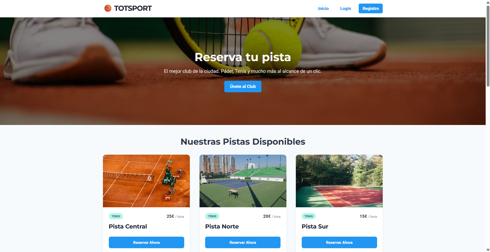
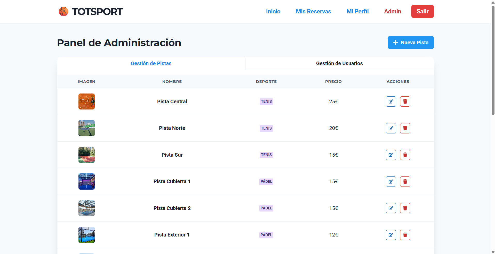
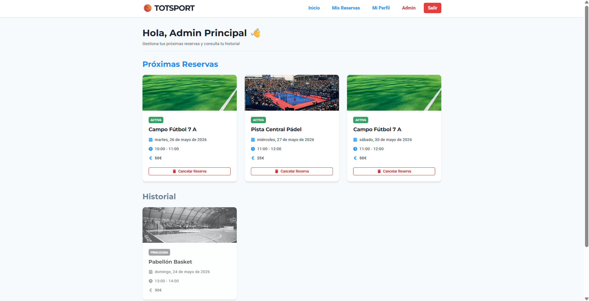

# 🖥️ TOTSPORT - Frontend (Cliente)
Este es el cliente web de la plataforma TOTSPORT, desarrollado como una Single Page Application (SPA) utilizando **React**, **Vite** y **Chakra UI**.

## Descripción 
La interfaz de usuario de TOTSPORT ha sido diseñada para ofrecer una experiencia fluida, intuitiva y responsive en la reserva de instalaciones deportivas. Se conecta directamente con la API REST del servidor para gestionar el estado de la autenticación, listar las pistas disponibles en tiempo real según el deporte y permitir a los usuarios visualizar y cancelar sus reservas desde un panel personal.

## Características
- **Diseño Responsive:** Interfaz moderna y completamente adaptable a dispositivos móviles, tablets y ordenadores de escritorio gracias al sistema de componentes de Chakra UI.
- **Gestión Eficiente de Formularios:** Uso de `react-hook-form` para optimizar el rendimiento de los inputs, gestionar estados locales y aplicar validaciones en tiempo real antes del envío.
- **Manejo de Estado Global:** Implementación de React Context API (`AuthContext`) para centralizar la sesión del usuario, inyectar tokens y proteger rutas privadas de la aplicación.
- **UX/UI Preventiva:** Lógica visual avanzada que deshabilita elementos de control (como botones de borrado o selectores de rol) si la acción no está permitida por políticas de seguridad (ej. autodegradación o mutaciones sobre el Administrador Principal).
- **Control Temporal en Vivo:** Filtros dinámicos que impiden seleccionar franjas horarias que ya han pasado en el día actual, evitando peticiones inválidas al backend.

## Tecnologías utilizadas
- react
- vite
- chakra-ui
- react-hook-form
- axios
- react-router-dom
- react-icons

## Instalación y uso local
1. Asegúrate de estar en la carpeta del cliente dentro de tu proyecto:

   `cd client`

2. Instala todas las dependencias necesarias:

   `npm install`

3. Crea un archivo `.env` en la raíz de esta carpeta `/client` con la URL de conexión a tu API (puedes apuntar a tu entorno local o al servidor de producción):

   `VITE_API_URL = https://totsport-backend.onrender.com/api/v1`

4. Inicia el servidor de desarrollo local de Vite:

   `npm run dev`

## Vistas y Componentes Principales

### Estructura de Páginas (`/src/pages`)
| Vista | Descripción | Acceso |
|-------|------|------------|
| Home | Portada principal que presenta el complejo deportivo y lista las pistas disponibles organizadas por categorías de deporte. | Público |
| Login / Register | Formularios optimizados para el acceso y registro de nuevos usuarios, incluyendo la carga de imágenes de perfil (avatar). | Público |
| Profile | Espacio personal donde el usuario logueado puede actualizar sus datos (nombre, imagen, contraseña) o dar de baja su cuenta. | Privado (User / Admin) |
| Dashboard | Panel que renderiza de forma reactiva el historial de reservas divididas en activas (con opción a cancelar) y pasadas (en escala de grises). | Privado (User / Admin) |
| Admin | Panel de control centralizado con sistema de pestañas para realizar CRUD de pistas y gestionar roles o eliminación de la comunidad de usuarios. | Privado (Admin) |

### Arquitectura de Componentes de Interfaz (`/src/components`)
- **Header / Footer:** Elementos de navegación global y pie de página que se adaptan dinámicamente según la sesión del usuario.
- **Layout:** Componente estructural maestro que envuelve las vistas principales (inyectando el Header y Footer) para mantener la consistencia del diseño en toda la aplicación.
- **CourtCard:** Componente modular encargado de mostrar de forma atractiva la información individual (imagen, deporte, precio) de cada pista deportiva.

## 📸 Capturas de Pantalla
*(Nota: Aquí se puede visualizar el acabado visual de la interfaz de usuario en producción)*

**1. Inicio y Catálogo de Pistas**

**2. Panel de Administración (Gestión de Comunidad)**

**3. Dashboard del Usuario e Historial**

## Control de Flujos en el Cliente
- **Consumo de API Limpio:** Uso de una instancia centralizada de `axios` que inyecta automáticamente el Token JWT guardado en las cabeceras `Authorization` de cada petición saliente.
- **Feedback visual mediante Toasts:** Notificaciones emergentes reactivas (`useToast` de Chakra) para informar al usuario de manera clara si sus operaciones (reservas, cancelaciones, cambios de datos) han sido exitosas o han devuelto algún error del servidor.